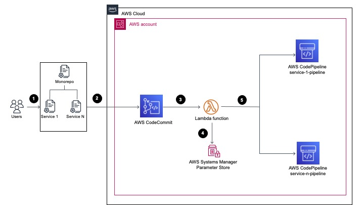

# CodeCommit monorepo multi pipeline triggers

This solution allows a mono-repository, which is composed of multiple services, have different CI/CD pipelines for each service. The solution detects which top level directory the modification happened and triggers the AWS CodePipeline configured to that directory.

 

First you create S3 bucket for store code lambda, after that you upload lambda.zip to bucket.    
Store the templates in anothe bucket for deploy cloudformation.   
